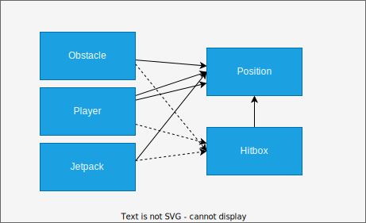

# Hitboxes

Hitboxen können als Schattenobjekte der eigentlichen Objekte betrachtet werden.

Hier ist ein einfaches Diagram welches die Beziehungen veranschaulichen soll.

Hier ist ersichtlich, dass das beispielsweise das Objekt [Obstacle] ein Objekt [Position] implementiert. Das [Hitbox] Objekt implementiert ebenfalls die [Position].
Das hat den Effekt, dass bei einem Update der Position auf dem [Obstacle] ebenfalls die [Hitbox] aktualisiert werden muss!
Es wurde versucht die gleiche Position zu verwenden, das funktioniert aber nicht, da die [Hitbox] immer etwas kleiner ist als das Objekt selber und sonst würde es die [Hitbox] verschieben.

[Position]: ../../src/main/java/ch/teko/bir/jumpdude/Position.java
[Hitbox]: ../../src/main/java/ch/teko/bir/jumpdude/Hitbox/Hitbox.java
[Obstacle]: ../../src/main/java/ch/teko/bir/jumpdude/Obstacles/Obstacle.java
