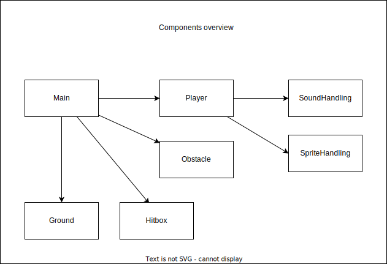

# Konzept

## Software Architektur

Das spiel soll Komponentenbasiert geschrieben werden, siehe Readme.
Die einzelnen Komponenten können eine View, Model und einen Controller enthalten. Die Idee ist, dass die einzelnen Komponenten einfach ausgetauscht oder erweitert werden können.

Es soll ebenfalls Statusbasiert sein. Heisst, die Komponenten enthalten einen Status in welchem definiert wird ob sie aktiv sind oder nicht.

Im unteren Diagram sind einige Komponenten ersichtlich die das Spiel sicherlich benötigt.
Die Darstellung ist sehr Abstrakt und ist kein Klassendiagramm. Eine Komponente kann aus mehreren Klassen bestehen.

